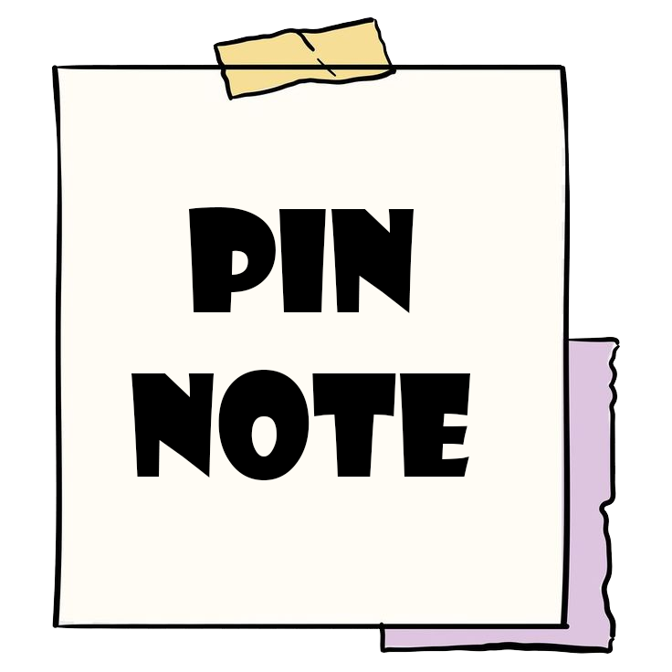

# 📝 Pin Sticky Notes

<div align="center">

<p align="center">
  
</p>

<p align="center">
  <a href="https://github.com/yeongpin/pin-sticky-notes/releases/latest">
    
  </a>
  <a href="https://creativecommons.org/licenses/by-nc-nd/4.0/">
    
  </a>
  <a href="https://github.com/yeongpin/pin-sticky-notes/stargazers">
    
  </a>
  <br/>
  <a href="https://github.com/yeongpin/pin-sticky-notes/releases">
    
  </a>
</p>

<p align="center">
  <b>A modern and elegant sticky notes application built with Electron and Vue.js</b>
</p>

<p align="center">
  <a href="#-features">Features</a> •
  <a href="#-installation">Installation</a> •
  <a href="#-tech-stack">Tech Stack</a> •
  <a href="#-development">Development</a>
</p>


</div>

## ✨ Features

- 📝 Create and manage multiple sticky notes
- 🎨 Customizable note colors
- 🌍 Multi-language support (English/Traditional Chinese)
- 🔍 Text zoom functionality
- 🔄 Text translation support
- 📌 Pin notes to top
- 🔔 System tray support
- 💾 Auto-save functionality
- 🌓 Light/Dark theme support
- ⚡ Fast and lightweight

## 🚀 Installation

### System Requirements

| Requirement | Version |
|------------|---------|
| Node.js | ≥ 16.0.0 |
| npm | ≥ 8.0.0 |

### Quick Start

```bash
# Clone the repository
git clone https://github.com/yeongpin/pin-sticky-notes.git

# Navigate to project directory
cd pin-sticky-notes

# Install dependencies
npm install

# Start development server
npm run electron:dev
```

## 🛠 Tech Stack

| Category | Technologies |
|----------|-------------|
| Framework |   |
| UI |  |
| State Management |  |
| Build Tools |  |

## 📁 Project Structure

```plaintext
pin-sticky-notes/
├── src/
│   ├── main/          # Main process files
│   ├── preload/       # Preload scripts
│   └── renderer/      # Frontend Vue.js files
│       ├── components/  # Vue components
│       ├── store/       # State management
│       ├── locales/     # i18n translations
│       └── assets/      # Static assets
└── build/            # Build configuration
```

## 🔨 Development

```bash
# Start development
npm run electron:dev

# Build application
npm run build

# Run tests
npm run test
```

## 📄 License

This project is licensed under the Creative Commons Attribution-NonCommercial-NoDerivatives 4.0 International License - see the [LICENSE](LICENSE.md) file for details.

## 🙏 Acknowledgments

- [Electron](https://www.electronjs.org/)
- [Vue.js](https://vuejs.org/)
- [Element Plus](https://element-plus.org/)

---

<p align="center">Made with ❤️ by <a href="https://github.com/yeongpin">yeongpin</a></p>


